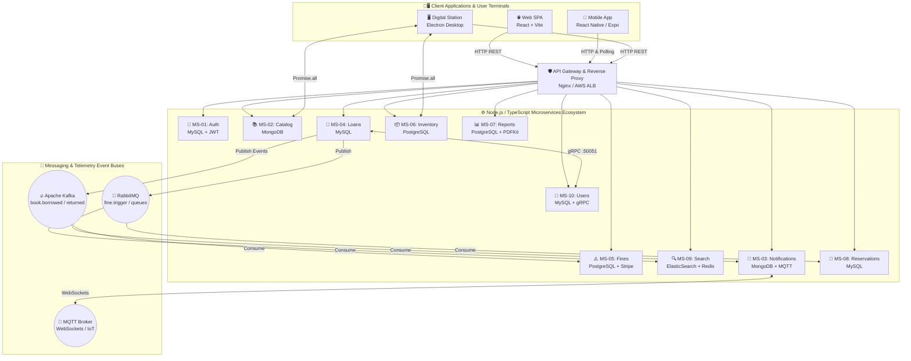

<div align="center">

# 🏛️ UCE Library - Distributed Library Management System
### Universidad Central del Ecuador (UCE)

[](https://github.com/kachiliquingal/uce-library-distributed-system)
[](https://nodejs.org/)
[](https://www.typescriptlang.org/)
[](https://react.dev/)
[](https://expo.dev/)
[](https://www.electronjs.org/)
[](https://www.docker.com/)
[](https://aws.amazon.com/)

<p align="center">
  <b>Author & Developer: <a href="https://github.com/kachiliquingal">Kleber Alejandro Chiliquinga Lara</a></b><br>
  <b>Course: Distributed Programming | Universidad Central del Ecuador (UCE)</b><br>
  A highly scalable, fault-tolerant, and event-driven enterprise-grade university platform.<br>
  Designed to manage bibliographic circulation, digital catalogs, physical inventory control, and financial analytics across UCE faculties.
</p>

---
</div>

## 🌟 Architectural Vision & Philosophy

The **UCE Library Distributed System** represents state-of-the-art cloud software engineering and distributed architecture. Engineered under the **Independent Microservices** pattern and **Hexagonal Architecture (Ports and Adapters)**, the ecosystem eliminates monolithic bottlenecks while guaranteeing extreme fault tolerance, elastic scalability, and technological decoupling.

### 📐 Core Architectural Principles:
1. **Database-per-Service (Polyglot Persistence):** Each microservice maintains absolute ownership of its own database, selecting the optimal database engine based on data characteristics (Relational ACID for loans and finances, NoSQL for polymorphic catalogs and alerts, and Inverted Indexes for high-speed searching).
2. **Event-Driven Architecture (EDA):** Non-blocking asynchronous communication via message brokers (**Apache Kafka** and **RabbitMQ**) to ensure eventual consistency and loose coupling across domain boundaries.
3. **gRPC for Critical Internal Communication:** Ultra-fast binary Remote Procedure Call exchanges (Protocol Buffers) for sub-millisecond inter-service validations without HTTP parsing overhead.
4. **Unified API Gateway:** Centralized routing and reverse proxy point built on **Nginx**, protecting private AWS internal subnets while managing CORS, load balancing, and WebSocket upgrades.

---

## 🗺️ Distributed Architecture Diagram



---

## 📦 Applications & Microservices Ecosystem

The repository is structured as a modern monorepo within the `/apps` directory. Each individual service includes its own dedicated `README.md` detailing internal architecture, ports, environment variables, and endpoints:

| Service / Application | Directory | Internal Port | Technology Stack | Database / Engine | Main Description |
| :--- | :--- | :---: | :--- | :--- | :--- |
| **🛡️ API Gateway** | [`/apps/api-gateway`](file:///C:/Users/ALEJANDRO/Documents/progra-distribuida/uce-library-distributed-system/apps/api-gateway/README.md) | `80` | Nginx, Docker | N/A | Single point of entry, reverse routing, and load balancing. |
| **🔐 MS-01: Auth Service** | [`/apps/auth-service`](file:///C:/Users/ALEJANDRO/Documents/progra-distribuida/uce-library-distributed-system/apps/auth-service/README.md) | `3001` | Express, TypeScript | MySQL | Institutional authentication, JWT issuance, and bcrypt hashing. |
| **📚 MS-02: Catalog Service** | [`/apps/catalog-service`](file:///C:/Users/ALEJANDRO/Documents/progra-distribuida/uce-library-distributed-system/apps/catalog-service/README.md) | `3002` | Express, TypeScript | MongoDB | Bibliographic catalog, polymorphic metadata, and NoSQL schemas. |
| **🔔 MS-03: Notification Service**| [`/apps/notification-service`](file:///C:/Users/ALEJANDRO/Documents/progra-distribuida/uce-library-distributed-system/apps/notification-service/README.md)| `3005` | Express, TypeScript | MongoDB, MQTT | Real-time alert engine, background queues, and WebSockets. |
| **📖 MS-04: Loan Service** | [`/apps/loan-service`](file:///C:/Users/ALEJANDRO/Documents/progra-distribuida/uce-library-distributed-system/apps/loan-service/README.md) | `3004` | Express, TypeScript | MySQL, Kafka, gRPC | Book circulation, borrow checkout, and return management. |
| **⚠️ MS-05: Fine Service** | [`/apps/fine-service`](file:///C:/Users/ALEJANDRO/Documents/progra-distribuida/uce-library-distributed-system/apps/fine-service/README.md) | `3006` | Express, TypeScript | PostgreSQL, Stripe | Automated late fee calculation and Stripe payment gateway. |
| **📦 MS-06: Inventory Service** | [`/apps/inventory-service`](file:///C:/Users/ALEJANDRO/Documents/progra-distribuida/uce-library-distributed-system/apps/inventory-service/README.md) | `3008` | Express, TypeScript | PostgreSQL | Strict ACID physical book stock control on library shelves. |
| **📊 MS-07: Report Service** | [`/apps/report-service`](file:///C:/Users/ALEJANDRO/Documents/progra-distribuida/uce-library-distributed-system/apps/report-service/README.md) | `3009` | Express, TypeScript | PostgreSQL, PDFKit | Management analytics and on-the-fly PDF report compilation. |
| **🎯 MS-08: Reservation Service**| [`/apps/reservation-service`](file:///C:/Users/ALEJANDRO/Documents/progra-distribuida/uce-library-distributed-system/apps/reservation-service/README.md)| `3010` | Express, TypeScript | MySQL, RabbitMQ | Strict FIFO waiting queue management for out-of-stock books.|
| **🔍 MS-09: Search Service** | [`/apps/search-service`](file:///C:/Users/ALEJANDRO/Documents/progra-distribuida/uce-library-distributed-system/apps/search-service/README.md) | `3007` | Express, TypeScript | ElasticSearch, Redis | Ultra-fast full-text search engine and sub-ms Redis cache. |
| **👥 MS-10: User Service** | [`/apps/user-service`](file:///C:/Users/ALEJANDRO/Documents/progra-distribuida/uce-library-distributed-system/apps/user-service/README.md) | `3003` / `50051` | Express, TypeScript | MySQL, gRPC | Institutional user management, academic profiles, and RBAC. |
| **🌐 Frontend Web App** | [`/apps/frontend`](file:///C:/Users/ALEJANDRO/Documents/progra-distribuida/uce-library-distributed-system/apps/frontend/README.md) | `80` / `5173` | React 18, Vite | Zustand, Tailwind | Administrative and student web SPA portal. |
| **📱 Mobile App** | [`/apps/mobile`](file:///C:/Users/ALEJANDRO/Documents/progra-distribuida/uce-library-distributed-system/apps/mobile/README.md) | `19000` | React Native, Expo | iOS / Android | Real-time mobile push notification center. |
| **🖥️ Desktop App** | [`/apps/desktop`](file:///C:/Users/ALEJANDRO/Documents/progra-distribuida/uce-library-distributed-system/apps/desktop/README.md) | `NATIVE` | Electron, Vanilla Web| Windows / Mac / Linux| Digital Station for rapid counter operations and student self-service. |

---

## 🔀 Protocols & Communication Matrix

The system leverages the right protocol for each specific architectural requirement:

1. **HTTP/1.1 REST & JSON:** Primary external communication protocol between clients (Frontend, Mobile, Desktop), the API Gateway, and microservice HTTP controllers.
2. **gRPC (HTTP/2 + Protocol Buffers):** High-performance synchronous internal communication between `loan-service` and `user-service` (Port `50051`), verifying student identity without JSON serialization overhead.
3. **Apache Kafka (Publish / Subscribe):** High-throughput domain event bus transmitting immutable facts (`book.borrowed`, `book.returned`, `book.indexed`) to search and notification engines.
4. **RabbitMQ (AMQP Advanced Queuing):** Transactional background job queue handling monetary penalty triggers (`fine.trigger`) and waiting list advancement (`reservation.ready`).
5. **MQTT WebSockets (Aedes Broker):** Real-time telemetry broadcasting and push alerts toward mobile devices and connected IoT displays (Ports `9001` / `1883`).

---

## 💾 Polyglot Persistence Matrix (Why Each DB?)

| Database Engine | Utilizing Services | Architectural Justification |
| :--- | :--- | :--- |
| **🐘 PostgreSQL** | `inventory`, `fines`, `reports` | Strict **ACID** transactional guarantees, row-level concurrency locking (`FOR UPDATE`), and financial precision for monetary penalties and physical stock without race conditions. |
| **🐬 MySQL** | `auth`, `users`, `loans`, `reservations` | High-performance relational integrity and structured schemas for institutional user records and book circulation lifecycles. |
| **🍃 MongoDB** | `catalog`, `notifications` | Flexible **NoSQL** schemas ideal for polymorphic bibliographic metadata (books vs theses vs scientific journals) and high-throughput write operations for alerts. |
| **⚡ Redis** | `search` (Cache), `auth` (Sessions) | Sub-millisecond in-memory key-value storage accelerating frequent catalog search queries and managing rate-limiting. |
| **🔍 ElasticSearch** | `search` (Core Engine) | State-of-the-art inverted indexes providing Full-Text Search, auto-completion, and typographical fault tolerance (Fuzzy Matching). |

---

## 🚀 Quick Start Guide (Local Docker Setup)

You can launch the entire distributed ecosystem (databases, message queues, backend microservices, and web clients) locally in minutes using **Docker Compose**:

### 1. Prerequisites
- **Docker Desktop** (with Docker Compose v2+)
- **Node.js 20+** and **npm** (for local development or manual building)
- **Git**

### 2. Clone & Configure
```bash
git clone https://github.com/kachiliquingal/uce-library-distributed-system.git
cd uce-library-distributed-system

# Install monorepo workspace dependencies (Turborepo)
npm install
```

### 3. Start Data Infrastructure & Messaging Buses
Launch database engines (MySQL, Postgres, Mongo), Redis cache, and message brokers (Kafka, RabbitMQ):
```bash
docker-compose -f deploy/docker-compose.db.yml up -d
```
*Wait ~30 seconds for database initializers and health checks to confirm cluster readiness.*

### 4. Start Microservices & API Gateway
Start all 10 backend microservices and the Nginx reverse proxy:
```bash
docker-compose -f deploy/docker-compose.apps.yml up -d --build
```

### 5. Accessing the Applications
- 🌐 **Web SPA Portal:** [http://localhost](http://localhost) (or [http://localhost:5173](http://localhost:5173) in dev mode)
- 🖥️ **Digital Station Desktop:** `cd apps/desktop && npm run start`
- 📱 **Mobile App (Expo):** `cd apps/mobile && npx expo start`
- 📖 **Swagger UI Documentation (via Gateway):** [http://localhost/api/auth/api-docs](http://localhost/api/auth/api-docs)
- 🐰 **RabbitMQ Management Dashboard:** [http://localhost:15672](http://localhost:15672) (user: `guest`, pass: `guest`)

---

## 🔄 Continuous Integration & Deployment (CI/CD)

The repository features enterprise-grade automation powered by GitHub Actions:
1. **CI Pipeline (`ci.yml`):** Executes linting, TypeScript type-checking, distributed unit testing via **Turborepo**, and Docker image build validation on every Pull Request.
2. **Infrastructure CD (`deploy-infra.yml`):** Provisions immutable cloud infrastructure across **AWS EC2 / VPC / ALB / ECS** using **Terraform** with remote S3 backend state.
3. **Application CD (`cd-apps.yml`):** Compiles optimized Docker images, pushes them to **DockerHub**, and orchestrates Zero-Downtime Deployments via Watchtower.

---
## 👨‍💻 Author & Developer

<div align="center">
  <h3>Kleber Alejandro Chiliquinga Lara</h3>
  <p><b>Author & Developer of the Project</b></p>
  <p><i>Course: Distributed Programming</i></p>
  <p><i>Universidad Central del Ecuador (UCE) - Faculty of Engineering</i></p>
  <p>
    <a href="https://github.com/kachiliquingal"></a>
  </p>
</div>

---
<div align="center">
  <p><b>Developed for the Distributed Programming course by Kleber Alejandro Chiliquinga Lara.</b></p>
  <p><i>© 2026 UCE Library Distributed System - Universidad Central del Ecuador.</i></p>
</div>